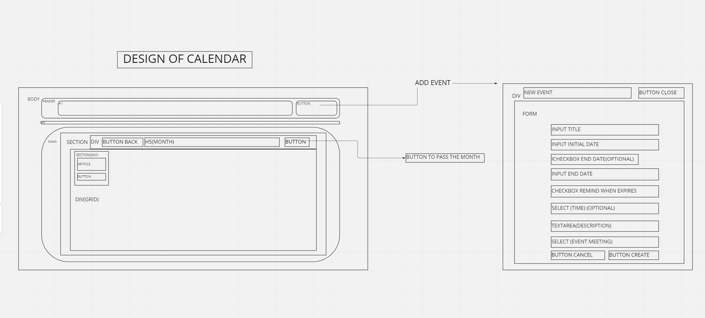
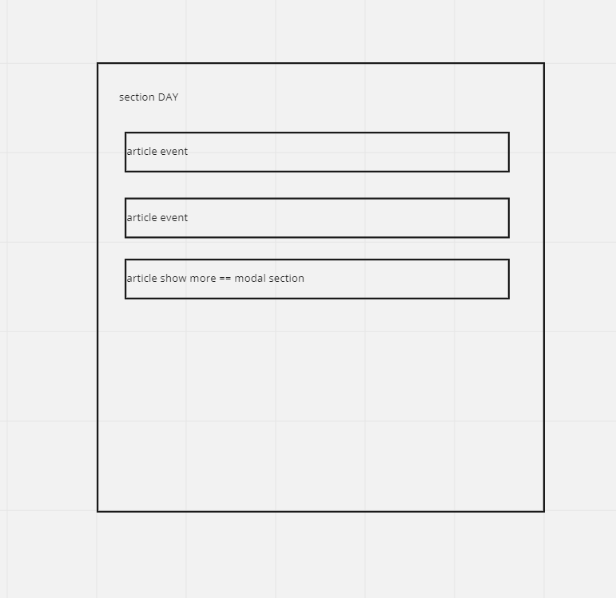
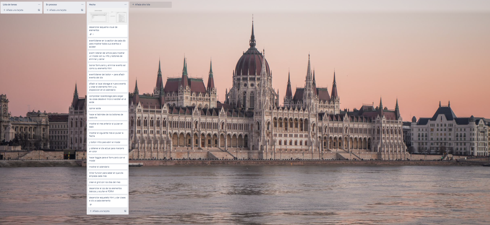
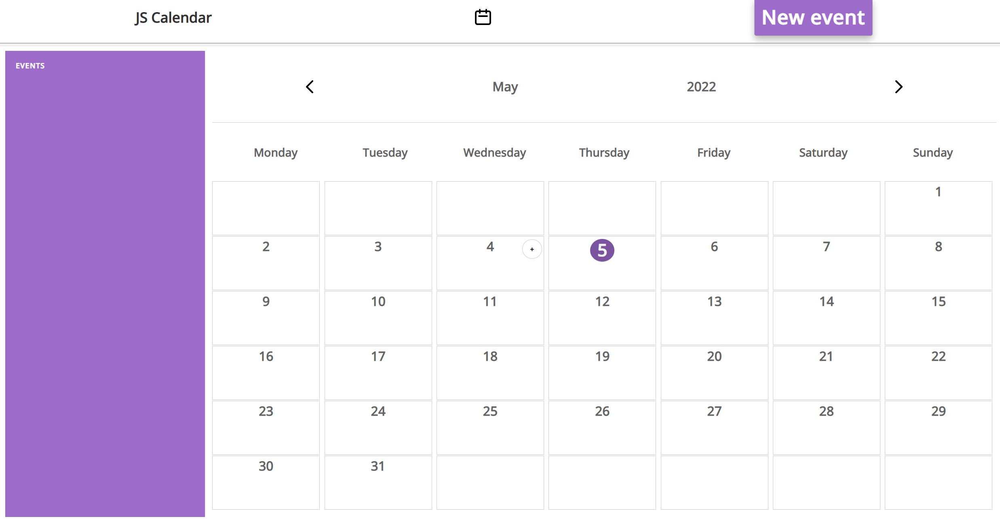
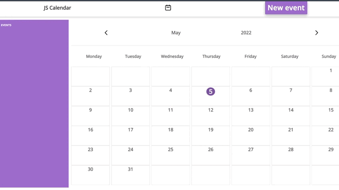

# JSCalendar
Project to developing a calendar

# Descripction

The project consists of the development of a calendar that must show all the months of the year and be able to store events, as well as delete them, taking into account the title, time, description and type of event.

# Technologies

CSS, HTML5, Javascript, localStorage, Date Objects, SMACSS.

# Organization and improvements

The way of organizing the project had several phases:

The initial phase consisted of defining the visual elements of the calendar as well as its semantic HTML5 tags in order to later implement it in the HTML document.

The next phase was the development of the functionality that allows scrolling through the months.

The following phases consisted of the development of the functionalities to show the modal and the addition and elimination of events.

This project has been realized by 100% peer coding.

###### Steps organization

##### PC image
 

# Demo
 

# Contributors
<a href="https://github.com/WalberMelo">Walber Melo</a> 
<a href="https://github.com/juliomc23">Julio Macias</a> 
<a href="https://github.com/JcarlosCabello1991">Juan Carlos Cabello</a> 

